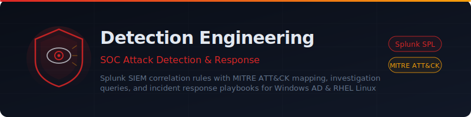

<p align="center">
  
</p>

<p align="center">
  <strong>SOC attack detection and response rules for Splunk SIEM with MITRE ATT&CK mapping, investigation queries, and incident response playbooks</strong>
</p>

<p align="center">
  
  
  
  
  
</p>

---

## Overview

Security Operation Center (SOC) attack detection and response rules for Splunk SIEM. Each rule includes comprehensive SPL queries, MITRE ATT&CK mapping, false positive tuning guidance, investigation queries, and incident response playbooks.

- **130+ detection rules** across Windows AD, RHEL Linux, and recent threat campaigns
- **MITRE ATT&CK mapped** -- every rule tagged with technique IDs and tactics
- **Investigation queries** -- ready-to-run SPL for SOC analyst triage
- **Incident response playbooks** -- step-by-step response procedures per attack type

---

## Repository Structure

```
Detection-Engineering/
├── README.md
├── docs/
│   └── banner.svg
└── splunk_rules/
    ├── credential_access/
    │   ├── adcs_attack_detection.yml
    │   ├── dcsync_attack_detection.yml
    │   ├── golden_ticket_attack_detection.yml
    │   ├── gpo_modification_detection.yml
    │   ├── kerberoasting_attack_detection.yml
    │   ├── lsass_credential_dumping_detection.yml
    │   ├── ntds_dit_extraction_detection.yml
    │   ├── pass_the_hash_detection.yml
    │   ├── password_spraying_detection.yml
    │   └── privileged_group_membership_modification_detection.yml
    ├── recent_attacks/
    │   └── cve_2026_21509_apt28_operation_neusploit_detection.yml
    └── rhel_linux/
        ├── rhel_privilege_escalation_detection.yml
        ├── rhel_persistence_detection.yml
        ├── rhel_credential_access_detection.yml
        ├── rhel_defense_evasion_detection.yml
        ├── rhel_execution_detection.yml
        ├── rhel_lateral_movement_detection.yml
        ├── rhel_discovery_enumeration_detection.yml
        └── rhel_exfiltration_detection.yml
```

## Detection Rules — Windows Active Directory

| Rule File | Attack Technique | MITRE ID | Severity | Detection Vectors |
|-----------|-----------------|----------|----------|-------------------|
| `adcs_attack_detection.yml` | ADCS Certificate Abuse (ESC1-ESC13) | T1649 | CRITICAL | 9 rules + 5 investigation queries |
| `dcsync_attack_detection.yml` | DCSync Credential Dumping | T1003.006 | CRITICAL | 5 rules + 4 investigation queries |
| `golden_ticket_attack_detection.yml` | Golden Ticket Kerberos Forgery | T1558.001 | CRITICAL | 6 rules + 8 investigation queries |
| `gpo_modification_detection.yml` | GPO Modification / Domain Policy Abuse | T1484.001 | CRITICAL | 7 rules + 8 investigation queries |
| `kerberoasting_attack_detection.yml` | Kerberoasting + AS-REP Roasting | T1558.003, T1558.004 | CRITICAL | 7 rules + 5 investigation queries |
| `lsass_credential_dumping_detection.yml` | LSASS Memory Credential Dumping | T1003.001 | CRITICAL | 7 rules + 5 investigation queries |
| `ntds_dit_extraction_detection.yml` | NTDS.dit Database Extraction | T1003.003 | CRITICAL | 8 rules + 8 investigation queries |
| `pass_the_hash_detection.yml` | Pass-the-Hash Lateral Movement | T1550.002 | CRITICAL | 6 rules + 5 investigation queries |
| `password_spraying_detection.yml` | Password Spraying + Brute Force | T1110.003, T1110.001 | HIGH–CRITICAL | 7 rules + 4 investigation queries |
| `privileged_group_membership_modification_detection.yml` | Privileged AD Group Modification | T1098.001 | CRITICAL | 6 rules + 7 investigation queries |

## Rule Format

Each detection rule file (YAML) includes:

- **Rule metadata** — name, description, MITRE ATT&CK mapping, confidence, risk score
- **Splunk SPL query** — ready-to-deploy correlation search
- **Schedule configuration** — cron, time window, throttle settings
- **Splunk ES actions** — notable event creation, risk scoring
- **False positive guidance** — known FPs and tuning instructions
- **Investigation queries** — manual IR queries for deeper analysis
- **Response playbook** — step-by-step incident response procedure

---

## DCSync Attack Detection

**File**: `splunk_rules/credential_access/dcsync_attack_detection.yml`

Detects DCSync credential dumping (MITRE T1003.006) through 5 complementary detection rules:

| Rule | Detection Method | Event IDs | Confidence |
|------|-----------------|-----------|------------|
| Rule 1 | User account performing replication | 4662 + 4624 | HIGH |
| Rule 2 | Replication from non-DC source IP | 4662 + 4624 + DC lookup | HIGH |
| Rule 3 | Replication permissions granted | 5136 | HIGH |
| Rule 4 | Bulk replication burst (volume anomaly) | 4662 | MEDIUM-HIGH |
| Rule 5 | DRSUAPI network traffic from non-DC | Network Traffic model | HIGH |

### Prerequisites

1. **Audit Policy** — Enable "Audit Directory Service Access" (Success) on all DCs
2. **SACL** — Configure auditing on domain root for replication extended rights
3. **Log Forwarding** — Splunk Universal Forwarder on all DCs forwarding Security logs
4. **DC IP Lookup** — `dc_ip_list.csv` for Rules 2 and 5

### Quick Deploy

1. Copy the SPL query from Rule 1 into Splunk > Search & Reporting
2. Replace `YOURDC01$`, `YOURDC02$` with your actual DC machine account names
3. Add any Azure AD Connect service accounts (`MSOL_*`) to the exclusion list
4. Save as a scheduled search or Splunk ES correlation search
5. Test with a 24-hour lookback to verify baseline before enabling alerts

---

## ADCS Attack Detection

**File**: `splunk_rules/credential_access/adcs_attack_detection.yml`

Detects Active Directory Certificate Services abuse (MITRE T1649) through 9 complementary detection rules covering ESC1 through ESC13:

| Rule | Detection Method | Event IDs | ESC Variant | Confidence |
|------|-----------------|-----------|-------------|------------|
| Rule 1 | Certificate issued with SAN mismatch | 4887 | ESC1 | HIGH |
| Rule 2 | Suspicious PKINIT certificate authentication | 4768 | ESC1/ESC3 | HIGH |
| Rule 3 | Certificate template modification | 5136 | ESC4 | HIGH |
| Rule 4 | EDITF_ATTRIBUTESUBJECTALTNAME2 flag | 4688, 4104, 4657 | ESC6 | CRITICAL |
| Rule 5 | Machine PKINIT from unexpected IP | 4768 | ESC8 | HIGH |
| Rule 6 | Vulnerable template detection (daily audit) | 4898 | ESC2/ESC3 | MEDIUM |
| Rule 7 | ADCS attack tool detection | 4688, 4104 | All | HIGH |
| Rule 8 | OID group link modification | 5136 | ESC13 | HIGH |
| Rule 9 | CA configuration change | 4890, 4876 | ESC5/ESC7 | MEDIUM-HIGH |

### Prerequisites

1. **Audit Policy** — Enable "Audit Certification Services" (Success + Failure) on all CAs
2. **Audit Policy** — Enable "Audit Directory Service Changes" (Success) on all DCs
3. **Log Forwarding** — Splunk Universal Forwarder on all CAs and DCs forwarding Security logs
4. **Machine IP Lookup** — `machine_ip_list.csv` for Rule 5 (machine account to expected IP mapping)
5. **Certificate Template Auditing** — Enable object access auditing on certificate template objects in AD

### Quick Deploy

1. Copy the SPL query from Rule 1 into Splunk > Search & Reporting
2. Replace `YOUR-CA-01` with your actual CA server hostname
3. Add legitimate enrollment service accounts to the exclusion list
4. Save as a scheduled search or Splunk ES correlation search
5. Test with a 7-day lookback to establish a baseline of normal certificate issuance
6. Deploy Rules 6 and 9 first (lower noise) before enabling the higher-fidelity rules

---

## Kerberoasting Attack Detection

**File**: `splunk_rules/credential_access/kerberoasting_attack_detection.yml`

Detects Kerberoasting (MITRE T1558.003) and AS-REP Roasting (MITRE T1558.004) through 7 complementary detection rules:

| Rule | Detection Method | Event IDs | Technique | Confidence |
|------|-----------------|-----------|-----------|------------|
| Rule 1 | RC4 encryption downgrade in TGS request | 4769 | T1558.003 | HIGH |
| Rule 2 | Bulk TGS requests — volume anomaly (spray) | 4769 | T1558.003 | HIGH |
| Rule 3 | Privileged service account targeted (adminCount=1) | 4769 | T1558.003 | HIGH |
| Rule 4 | AS-REP Roasting — pre-auth disabled account | 4768 | T1558.004 | HIGH |
| Rule 5 | Kerberoasting tool execution (Rubeus, Invoke-Kerberoast, Impacket) | 4688, 4104 | T1558.003/004 | HIGH |
| Rule 6 | RC4 TGS from external or non-standard source | 4769 | T1558.003 | HIGH |
| Rule 7 | SPN enumeration precursor — LDAP/PowerShell | 1644, 4688, 4104 | T1087.002 | MEDIUM |

### Prerequisites

1. **Audit Policy** — Enable "Audit Kerberos Service Ticket Operations" (Success + Failure) on all DCs
2. **Audit Policy** — Enable "Audit Kerberos Authentication Service" (Success + Failure) on all DCs
3. **Command-Line Logging** — Enable process creation with command-line logging via GPO on all endpoints
4. **PowerShell Logging** — Enable Script Block Logging via GPO on all endpoints
5. **Log Forwarding** — Splunk Universal Forwarder on all DCs and endpoints forwarding Security + PowerShell logs
6. **Privileged SPN Lookup** — `privileged_spn_accounts.csv` in Splunk for Rule 3 (scheduled AD export)

### Quick Deploy

1. Start with Rule 1 (RC4 downgrade) — highest-confidence, lowest noise in AES-enforced environments
2. Baseline your environment for legitimate RC4 consumers before enabling (run as report for 14 days first)
3. Build the `privileged_spn_accounts.csv` lookup from AD (`adminCount=1` + `servicePrincipalName` set)
4. Deploy Rule 4 (AS-REP Roasting) immediately — `PreAuthType=0` should never occur in hardened AD
5. Deploy Rule 5 (tool detection) immediately — zero expected false positives from legitimate tooling
6. Tune Rule 2 volume threshold (default 10 SPNs/15 min) using your environment baseline

---

## LSASS Credential Dumping Detection

**File**: `splunk_rules/credential_access/lsass_credential_dumping_detection.yml`

Detects OS credential dumping via LSASS process memory (MITRE T1003.001) through 7 complementary detection rules covering Mimikatz, Sysinternals ProcDump, comsvcs.dll MiniDump (LOLBAS), Task Manager dumps, WerFault abuse, and SSP/DLL injection:

| Rule | Detection Method | Event IDs | Technique | Confidence |
|------|-----------------|-----------|-----------|------------|
| Rule 1 | Sysmon ProcessAccess to lsass.exe — suspicious GrantedAccess bitmask | Sysmon 10 | T1003.001 | HIGH |
| Rule 2 | LSASS memory dump file created in suspicious path | Sysmon 11 | T1003.001 | HIGH |
| Rule 3 | Mimikatz binary, CLI syntax, or Invoke-Mimikatz detected | 4688, Sysmon 1, 4104 | T1003.001 | HIGH |
| Rule 4 | ProcDump / comsvcs.dll MiniDump / createdump / WerFault targeting LSASS | 4688, Sysmon 1 | T1003.001, T1218.011 | HIGH |
| Rule 5 | Unsigned or unexpected DLL loaded into lsass.exe process space | Sysmon 7 | T1003.001, T1547.005 | MEDIUM-HIGH |
| Rule 6 | WDigest UseLogonCredential registry key enabled — plaintext credential staging | Sysmon 13, 4657 | T1003.001, T1112 | HIGH |
| Rule 7 | SeDebugPrivilege acquired by non-system process — Mimikatz precursor | 4703 | T1134.001 | MEDIUM |

### Prerequisites

1. **Sysmon Deployment** — Deploy Sysmon with LSASS ProcessAccess (Event 10), FileCreate for .dmp (Event 11), ImageLoad into lsass.exe (Event 7), and RegistryValueSet (Event 13) rules enabled
2. **Audit Policy** — Enable "Audit Process Creation" (Success) with command-line logging on all endpoints
3. **PowerShell Logging** — Enable Script Block Logging via GPO on all endpoints
4. **Audit Token Rights** — Enable "Audit Token Right Adjusted" (Event 4703) for Rule 7
5. **Log Forwarding** — Splunk Universal Forwarder on all endpoints forwarding Security + Sysmon + PowerShell logs
6. **LSASS Allowlist** — Build `lsass_access_allowlist.csv` with known-legitimate processes (EDR/AV agents, Windows system processes)

### Quick Deploy

1. Deploy Rule 3 (Mimikatz CLI syntax) and Rule 4 (ProcDump/comsvcs.dll) first — zero noise, immediate value
2. Deploy Rule 6 (WDigest enable) immediately — no false positives, and gives advance warning before dumping occurs
3. Deploy Rule 2 (dump file creation) next — low noise, catches the output artifact regardless of tool used
4. Build your `lsass_access_allowlist.csv` by monitoring Rule 1 (Sysmon Event 10) in report mode for 7 days to identify legitimate LSASS callers in your environment
5. Enable Rule 1 (GrantedAccess) after allowlist is built — highest fidelity, requires tuning
6. Enable LSASS PPL (`RunAsPPL=1`) and Credential Guard to reduce attack surface while detection is being tuned

---

## Pass-the-Hash Detection

**File**: `splunk_rules/credential_access/pass_the_hash_detection.yml`

Detects Pass-the-Hash lateral movement (MITRE T1550.002) through 6 complementary detection rules covering classic NTLM hash replay, Mimikatz sekurlsa::pth, Overpass-the-Hash, Impacket tool signatures, and chained TTP correlation with LSASS dumps:

| Rule | Detection Method | Event IDs | Technique | Confidence |
|------|-----------------|-----------|-----------|------------|
| Rule 1 | Classic PtH — NTLM Type 3, null subject SID, KeyLength=0 | 4624 | T1550.002 | HIGH |
| Rule 2 | Mimikatz sekurlsa::pth — LogonType 9 + seclogo process | 4624 | T1550.002 | HIGH |
| Rule 3 | Rapid NTLM lateral movement — single source, 5+ targets in 5 min | 4624 | T1021.002 | HIGH |
| Rule 4 | Impacket tool signatures (psexec/smbexec/wmiexec hardcoded strings) | 7045, 4697, 5140 | T1550.002 | HIGH |
| Rule 5 | Overpass-the-Hash — RC4 TGT request via NT hash conversion | 4768 | T1550.002 | MEDIUM-HIGH |
| Rule 6 | Chained TTP — LSASS access then NTLM logon from same source | Sysmon 10 + 4624 | T1003.001 + T1550.002 | HIGH |

### Prerequisites

1. **Audit Policy** — Enable "Audit Logon" (Success + Failure) on all domain-joined hosts
2. **Audit Policy** — Enable "Audit Special Logon" (Success) on all hosts
3. **Audit Policy** — Enable "Audit Kerberos Authentication Service" (Success + Failure) on all DCs
4. **Log Forwarding** — Splunk Universal Forwarder on all hosts forwarding Security logs
5. **Sysmon** — Deploy Sysmon with ProcessAccess (Event 10) for LSASS — required for Rule 6
6. **Lookup Tables** — `dc_ip_list.csv` (DC IPs) + `legacy_ntlm_hosts.csv` (legitimate NTLM consumers)

### Quick Deploy

1. Deploy Rule 2 (Mimikatz LogonType 9 / seclogo) immediately — zero expected false positives
2. Deploy Rule 4 (Impacket signatures) immediately — hardcoded tool strings have near-zero FP rate
3. Deploy Rule 1 (classic PtH) after building `legacy_ntlm_hosts.csv` to suppress legitimate NTLM sources
4. Enable Rule 3 (rapid lateral movement) after confirming the 5-target threshold fits your environment
5. Tune Rule 5 (Overpass-the-Hash) only after enforcing AES encryption domain-wide (disabling RC4)
6. Enable Rule 6 (chained TTP) after Sysmon LSASS ProcessAccess monitoring is in place

---

## Password Spraying Detection

**File**: `splunk_rules/credential_access/password_spraying_detection.yml`

Detects Password Spraying (MITRE T1110.003) and Brute Force (T1110.001) attacks through 7 complementary detection rules covering Kerberos and NTLM spray, account lockout storms, spray hit confirmation, username enumeration, and slow low-cadence APT spray patterns:

| Rule | Detection Method | Event IDs | Technique | Confidence |
|------|-----------------|-----------|-----------|------------|
| Rule 1 | Kerberos spray — 4771 Status=0x18, ≥10 accounts in 5 min | 4771 | T1110.003 | HIGH |
| Rule 2 | NTLM spray at DC — 4776 Status=0xC000006A, ≥10 accounts in 5 min | 4776 | T1110.003 | HIGH |
| Rule 3 | Single-account brute force — 4625, ≥20 failures, dc(account)≤2 | 4625 | T1110.001 | HIGH |
| Rule 4 | Account lockout storm — ≥5 locked accounts in 10 min | 4740 | T1110.003 | MEDIUM-HIGH |
| Rule 5 | Spray hit — failures ≥10 + success from same IP within 30 min | 4625 + 4624 | T1110.003 | HIGH |
| Rule 6 | Kerberos username enumeration — 4768 Status=0x6, ≥10 accounts in 2 min | 4768 | T1087.002 | HIGH |
| Rule 7 | Slow APT spray — 24h window, ≥20 accounts, <4 attempts/account | 4771, 4776 | T1110.003 | MEDIUM |

### Prerequisites

1. **Audit Policy** — Enable "Audit Kerberos Authentication Service" (Success + Failure) on all DCs
2. **Audit Policy** — Enable "Audit Credential Validation" (Success + Failure) on all DCs
3. **Audit Policy** — Enable "Audit Logon" (Success + Failure) on all DCs and endpoints
4. **Audit Policy** — Enable "Audit Account Lockout" (Success) on all DCs
5. **Log Forwarding** — Splunk Universal Forwarder on all DCs and endpoints forwarding Security logs

### Quick Deploy

1. Deploy Rule 5 (spray hit) first — confirms successful compromise, highest priority alert
2. Deploy Rule 1 (Kerberos 4771) immediately — Kerberos spray is the most common modern technique
3. Deploy Rule 4 (lockout storm) immediately — even lagging, mass lockouts need immediate response
4. Run Rule 7 (slow spray) in report mode for 30 days before alerting to baseline your environment
5. Tune the dc(account) threshold in Rule 1 (default: 10 accounts / 5 min) using 14-day baseline data

---

## Privileged Group Membership Modification Detection

**File**: `splunk_rules/credential_access/privileged_group_membership_modification_detection.yml`

Detects unauthorized modifications to privileged Active Directory groups (MITRE T1098.001) through 6 complementary detection rules covering all group types, direct LDAP writes, bulk escalation patterns, nested group abuse, and AdminSDHolder persistence:

| Rule | Detection Method | Event IDs | Technique | Confidence |
|------|-----------------|-----------|-----------|------------|
| Rule 1 | Member added to privileged group (all scope types) | 4728, 4732, 4756 | T1098.001 | HIGH |
| Rule 2 | Direct LDAP 'member' attribute write to privileged group | 5136 | T1098.001 | HIGH |
| Rule 3 | Bulk escalation — ≥3 privileged groups modified in 10 min | 4728, 4732, 4756 | T1098.001 | HIGH |
| Rule 4 | Nested group added to privileged group (inherited privilege) | 4728, 4732, 4756 | T1098.001 | MEDIUM-HIGH |
| Rule 5 | AdminSDHolder ACL modification — covert persistent privilege | 5136 | T1098.001 | HIGH |
| Rule 6 | Masquerade group creation mimicking privileged group name | 4731 | T1098.001 | MEDIUM |

### Prerequisites

1. **Audit Policy** — Enable "Audit Security Group Management" (Success) on all DCs
2. **Audit Policy** — Enable "Audit Directory Service Changes" (Success) on all DCs
3. **SACL** — Configure auditing on CN=AdminSDHolder for Rule 5
4. **Log Forwarding** — Splunk Universal Forwarder on all DCs forwarding Security logs
5. **Lookup Tables** — `privileged_group_admin_allowlist.csv` for known-legitimate GPO admin accounts

### Quick Deploy

1. Deploy Rule 1 immediately — direct group additions are the core detection with highest value
2. Deploy Rule 5 (AdminSDHolder) immediately — no false positives; very rare legitimate modification
3. Deploy Rule 2 (LDAP direct write) to catch BloodHound-based attacks that bypass standard events
4. Build the `privileged_group_admin_allowlist.csv` lookup to suppress IAM provisioning tool accounts
5. Enable Rule 3 (bulk escalation) after confirming the 3-group threshold does not fire during planned AD migrations

---

## Golden Ticket Detection

**File**: `splunk_rules/credential_access/golden_ticket_attack_detection.yml`

Detects Golden Ticket Kerberos forgery attacks (MITRE T1558.001) through 6 complementary detection rules. Golden Tickets are forged TGTs signed with the KRBTGT hash — no Event 4768 is generated by the KDC, making detection rely on secondary indicators:

| Rule | Detection Method | Event IDs | Technique | Confidence |
|------|-----------------|-----------|-----------|------------|
| Rule 1 | RC4 TGT in AES-enforced environment | 4768 | T1558.001 | HIGH |
| Rule 2 | RC4 TGS request in AES-enforced environment | 4769 | T1558.001 | MEDIUM-HIGH |
| Rule 3 | TGS request without preceding TGT issuance (forged TGT presented) | 4769 (absent 4768) | T1558.001 | HIGH |
| Rule 4 | Special privilege Kerberos logon with no TGT issuance | 4672 + 4624 (absent 4768) | T1558.001 | HIGH |
| Rule 5 | Anomalous krbtgt service ticket request | 4769 | T1558.001 | MEDIUM-HIGH |
| Rule 6 | TGT/TGS encryption type mismatch (AES TGT + RC4 TGS) | 4768 + 4769 | T1558.001 | MEDIUM |

### Prerequisites

1. **Audit Policy** — Enable "Audit Kerberos Authentication Service" (Success + Failure) on all DCs
2. **Audit Policy** — Enable "Audit Kerberos Service Ticket Operations" (Success + Failure) on all DCs
3. **Audit Policy** — Enable "Audit Special Logon" (Success) on all hosts
4. **AES Enforcement** — Domain-wide RC4 disablement via GPO required for Rule 1 and 2 to be effective
5. **Log Forwarding** — All DC Security logs in one Splunk index (critical for absence-of-TGT correlation)
6. **Lookup Tables** — `rc4_tgt_allowlist.csv` (legacy RC4 consumers) + `privileged_accounts.csv` (Rule 3 scope)

### Quick Deploy

1. Deploy Rule 3 (TGS without TGT) scoped to privileged accounts only — highest-fidelity indicator
2. Deploy Rule 4 (special privilege without TGT) — combination of 4672 + 4624 + absent 4768 is definitive
3. Enable Rules 1 and 2 (RC4 anomalies) ONLY after fully enforcing AES domain-wide and building allowlists
4. Run Rules 1 and 2 in report mode for 14 days first to eliminate legacy RC4 consumers from scope
5. For environments without AES enforcement: focus on Rules 3, 4, and 6 (encryption-agnostic indicators)

---

## NTDS.dit Extraction Detection

**File**: `splunk_rules/credential_access/ntds_dit_extraction_detection.yml`

Detects NTDS.dit Active Directory database extraction (MITRE T1003.003) through 8 complementary detection rules covering all major extraction techniques — ntdsutil IFM, VSS-based copies, LOLBin abuse, PowerShell WMI, and file-level SACL auditing:

| Rule | Detection Method | Event IDs | Technique | Confidence |
|------|-----------------|-----------|-----------|------------|
| Rule 1 | ntdsutil IFM execution on DC | 4688, Sysmon 1 | T1003.003 | HIGH |
| Rule 2 | vssadmin shadow copy creation on DC | 4688, Sysmon 1 | T1003.003 | HIGH |
| Rule 3 | diskshadow /s script mode on DC | 4688, Sysmon 1 | T1003.003 | HIGH |
| Rule 4 | esentutl /y /vss copy of NTDS.dit | 4688, Sysmon 1 | T1003.003 | HIGH |
| Rule 5 | PowerShell Win32_ShadowCopy + NTDS file copy | 4104 | T1003.003 | HIGH |
| Rule 6 | ntds.dit file created outside NTDS directory | Sysmon 11 | T1003.003 | HIGH |
| Rule 7 | NTDS.dit direct file access via SACL audit | 4663 | T1003.003 | MEDIUM-HIGH |
| Rule 8 | Multi-stage correlation — VSS creation + ntds.dit copy | Sysmon 1 + 11 | T1003.003 | HIGH |

### Prerequisites

1. **Process Creation Logging** — Enable "Audit Process Creation" (Success) with command-line on all DCs
2. **PowerShell Logging** — Enable Script Block Logging via GPO on all DCs
3. **Sysmon Deployment** — Deploy Sysmon on DCs with ProcessCreate (Event 1), FileCreate (Event 11)
4. **SACL on NTDS.dit** — Configure `Everyone: Read Data` auditing on `%SystemRoot%\NTDS\ntds.dit` for Rule 7
5. **Log Forwarding** — Splunk Universal Forwarder on all DCs forwarding Security + Sysmon + PowerShell logs
6. **DC Hostname Lookup** — `dc_hostnames.csv` to restrict vssadmin/diskshadow alerts to DCs only

### Quick Deploy

1. Deploy Rule 1 (ntdsutil IFM) immediately — highest fidelity, almost no legitimate use outside DCPromo
2. Deploy Rule 6 (ntds.dit outside NTDS path via Sysmon 11) — tool-agnostic, catches any extraction method
3. Deploy Rule 8 (kill chain correlation) for the highest-confidence, lowest-FP combined indicator
4. Deploy Rules 2–5 after populating `dc_hostnames.csv` to avoid false positives on non-DC servers
5. Configure SACL on NTDS.dit on all DCs to enable Rule 7 (file-level access audit)

---

## GPO Modification Detection

**File**: `splunk_rules/credential_access/gpo_modification_detection.yml`

Detects malicious Group Policy Object modification (MITRE T1484.001) through 7 complementary detection rules covering AD-layer GPO changes, SYSVOL payload injection, built-in policy tampering, security control disabling, and kill-chain correlation:

| Rule | Detection Method | Event IDs | Technique | Confidence |
|------|-----------------|-----------|-----------|------------|
| Rule 1 | Unauthorized GPO attribute modification in AD | 5136 | T1484.001 | HIGH |
| Rule 2 | New GPO created and linked to domain root or DC OU | 5137 + 5136 | T1484.001 | HIGH |
| Rule 3 | Malicious script/task file written to SYSVOL GPO directory | Sysmon 11 | T1484.001 | HIGH |
| Rule 4 | SharpGPOAbuse / StandIn / PowerGPOAbuse tool detection | 4688, Sysmon 1, 4104 | T1484.001 | HIGH |
| Rule 5 | Default Domain Policy or Default DC Policy modified | 5136 | T1484.001 | HIGH |
| Rule 6 | GPO used to disable Windows security controls (Defender, Firewall, WDigest) | 5136, Sysmon 11 | T1484.001, T1562.001 | HIGH |
| Rule 7 | Multi-stage kill chain — AD GPO change + SYSVOL write correlated | 5136 + Sysmon 11 | T1484.001 | HIGH |

### Prerequisites

1. **Audit Policy** — Enable "Audit Directory Service Changes" (Success) on all DCs
2. **Audit Policy** — Enable "Audit Directory Service Object Created" (Success) for Event 5137
3. **Sysmon Deployment** — Deploy Sysmon on DCs with FileCreate (Event 11) targeting SYSVOL paths
4. **Process Creation Logging** — Enable "Audit Process Creation" with command-line on all DCs/endpoints
5. **PowerShell Logging** — Enable Script Block Logging via GPO for PowerShell-based GPO abuse detection
6. **Lookup Tables** — `gpo_admin_allowlist.csv` with authorised GPO administrator accounts

### Quick Deploy

1. Deploy Rule 5 (Default Domain/DC Policy) immediately — any change here has domain-wide impact
2. Deploy Rule 3 (SYSVOL payload write via Sysmon 11) — tool-agnostic, catches the payload regardless of attack method
3. Deploy Rule 4 (tool signatures) immediately — SharpGPOAbuse/StandIn strings have zero FP rate
4. Deploy Rule 6 (security control disabling) — disable-Defender patterns require no baseline period
5. Build `gpo_admin_allowlist.csv` before enabling Rule 1 to suppress legitimate GPO administrators
6. Enable Rule 7 (kill chain) after Rules 1 and 3 are confirmed operational

---

## RHEL Linux Detection Rules

Detection rules for Red Hat Enterprise Linux attack techniques across 8 MITRE ATT&CK tactics. Covers the full attack lifecycle from initial discovery through privilege escalation, persistence, credential access, defense evasion, execution, lateral movement, and exfiltration. **63 detection rules + 40 investigation queries + 8 incident response playbooks.**

### Rule Summary

| Rule File | Attack Technique | MITRE ID | Severity | Detection Vectors |
|-----------|-----------------|----------|----------|-------------------|
| `rhel_privilege_escalation_detection.yml` | Sudo Abuse, SUID/SGID, Kernel Exploits, Container Escape | T1548.003, T1548.001, T1068, T1611 | HIGH–CRITICAL | 8 rules + 5 investigation queries |
| `rhel_persistence_detection.yml` | Cron, Systemd, SSH Keys, PAM, LD_PRELOAD, Shell Profiles | T1053.003, T1543.002, T1098.004, T1556.003, T1574.006, T1546.004 | HIGH–CRITICAL | 9 rules + 5 investigation queries |
| `rhel_credential_access_detection.yml` | Shadow File, SSH Key Theft, Brute Force, Ptrace, Keylogger | T1003.008, T1552.004, T1110.001, T1003, T1056.001 | HIGH–CRITICAL | 8 rules + 5 investigation queries |
| `rhel_defense_evasion_detection.yml` | Auditd Tampering, Log Deletion, SELinux, Rootkits, Timestomping | T1562.001, T1070.002, T1070.006, T1014, T1036.004 | HIGH–CRITICAL | 9 rules + 5 investigation queries |
| `rhel_execution_detection.yml` | Reverse Shells, Webshells, Fileless, Log4Shell, Ptrace Injection | T1059.004, T1059.006, T1620, T1505.003, T1055.008, T1203 | HIGH–CRITICAL | 8 rules + 5 investigation queries |
| `rhel_lateral_movement_detection.yml` | SSH Tunneling, Agent Forwarding, SCP/Rsync, Network Scanning | T1021.004, T1572, T1563.001, T1072, T1046, T1210 | MEDIUM–CRITICAL | 7 rules + 5 investigation queries |
| `rhel_discovery_enumeration_detection.yml` | LinPEAS/LinEnum, System Recon, User Enum, Container Discovery | T1059.004, T1082, T1087.001, T1016, T1518.001, T1613 | MEDIUM–HIGH | 7 rules + 5 investigation queries |
| `rhel_exfiltration_detection.yml` | DNS Tunneling, HTTP Upload, Archive Staging, Encoded Data | T1560.001, T1048.003, T1048.002, T1132.001, T1119 | HIGH–CRITICAL | 7 rules + 5 investigation queries |

---

### RHEL Privilege Escalation Detection

**File**: `splunk_rules/rhel_linux/rhel_privilege_escalation_detection.yml`

Detects Linux privilege escalation techniques (MITRE T1548, T1068, T1611) through 8 complementary detection rules:

| Rule | Detection Method | Data Source | Technique | Confidence |
|------|-----------------|-------------|-----------|------------|
| Rule 1 | Sudo abuse — unauthorized sudo, sudo to root shell | auditd EXECVE | T1548.003 | HIGH |
| Rule 2 | Sudoers file modification — visudo bypass, echo injection | auditd SYSCALL/PATH | T1548.003 | HIGH |
| Rule 3 | SUID/SGID binary exploitation — find/vim/nmap/python | auditd EXECVE | T1548.001 | HIGH |
| Rule 4 | Kernel exploit indicators — dirty pipe/cow, exploit compilation | auditd EXECVE, syslog | T1068 | CRITICAL |
| Rule 5 | Linux capabilities abuse — cap_setuid, cap_dac_override | auditd EXECVE | T1548 | HIGH |
| Rule 6 | PwnKit / Polkit exploitation (CVE-2021-4034) | auditd EXECVE, syslog | T1068 | CRITICAL |
| Rule 7 | Container escape to host — nsenter, mount /proc, chroot | auditd EXECVE | T1611 | CRITICAL |
| Rule 8 | Cgroup escape — notify_on_release abuse | auditd EXECVE/SYSCALL | T1611 | CRITICAL |

---

### RHEL Persistence Detection

**File**: `splunk_rules/rhel_linux/rhel_persistence_detection.yml`

Detects Linux persistence mechanisms (MITRE T1053, T1543, T1098, T1556, T1574, T1546, T1037, T1547) through 9 complementary detection rules:

| Rule | Detection Method | Data Source | Technique | Confidence |
|------|-----------------|-------------|-----------|------------|
| Rule 1 | Malicious cron job — reverse shells, download-and-execute | auditd SYSCALL/PATH | T1053.003 | HIGH |
| Rule 2 | Rogue systemd service — ExecStart pointing to /tmp, /dev/shm | auditd SYSCALL, syslog | T1543.002 | HIGH |
| Rule 3 | SSH authorized_keys injection — unauthorized key addition | auditd SYSCALL/PATH | T1098.004 | HIGH |
| Rule 4 | PAM backdoor module — pam_exec, custom .so in /lib/security | auditd SYSCALL | T1556.003 | CRITICAL |
| Rule 5 | LD_PRELOAD hijacking — /etc/ld.so.preload, LD_PRELOAD env | auditd EXECVE, SYSCALL | T1574.006 | CRITICAL |
| Rule 6 | Shell profile backdoor — .bashrc, .bash_profile, /etc/profile.d | auditd SYSCALL/PATH | T1546.004 | HIGH |
| Rule 7 | Malicious at job scheduling | auditd EXECVE | T1053.002 | HIGH |
| Rule 8 | Init script / rc.local persistence | auditd SYSCALL | T1037.004 | HIGH |
| Rule 9 | Kernel module persistence — insmod, modprobe from non-standard path | auditd SYSCALL | T1547.006 | CRITICAL |

---

### RHEL Credential Access Detection

**File**: `splunk_rules/rhel_linux/rhel_credential_access_detection.yml`

Detects Linux credential theft techniques (MITRE T1003, T1552, T1110, T1056, T1558) through 8 complementary detection rules:

| Rule | Detection Method | Data Source | Technique | Confidence |
|------|-----------------|-------------|-----------|------------|
| Rule 1 | /etc/shadow access — unshadow, cat/cp shadow, john/hashcat | auditd SYSCALL/EXECVE | T1003.008 | CRITICAL |
| Rule 2 | SSH private key theft — copying id_rsa, .pem from .ssh dirs | auditd SYSCALL/EXECVE | T1552.004 | HIGH |
| Rule 3 | SSH brute force — ≥10 failed auth in 5 min from single source | linux_secure | T1110.001 | HIGH |
| Rule 4 | Ptrace-based credential dumping — gdb attach, strace on sshd | auditd SYSCALL | T1003 | HIGH |
| Rule 5 | Keylogger installation — xinput, logkeys, pam_tty_audit | auditd EXECVE | T1056.001 | HIGH |
| Rule 6 | Credential files in non-standard locations — .netrc, .pgpass, .my.cnf | auditd EXECVE | T1552.001 | MEDIUM-HIGH |
| Rule 7 | Kerberos keytab theft — ktutil, klist, keytab file copy | auditd EXECVE/SYSCALL | T1558.004 | HIGH |
| Rule 8 | LDAP credential harvesting — ldapsearch with password attributes | auditd EXECVE | T1003 | HIGH |

---

### RHEL Defense Evasion Detection

**File**: `splunk_rules/rhel_linux/rhel_defense_evasion_detection.yml`

Detects Linux defense evasion techniques (MITRE T1562, T1070, T1014, T1036) through 9 complementary detection rules:

| Rule | Detection Method | Data Source | Technique | Confidence |
|------|-----------------|-------------|-----------|------------|
| Rule 1 | Auditd tampering — service stop, auditctl -e 0, config modification | auditd SYSCALL/EXECVE | T1562.001 | CRITICAL |
| Rule 2 | Log deletion — rm/shred/truncate on /var/log files | auditd EXECVE | T1070.002 | CRITICAL |
| Rule 3 | Timestomping — touch -t, touch -r to alter file timestamps | auditd EXECVE | T1070.006 | HIGH |
| Rule 4 | SELinux disabling — setenforce 0, SELINUX=disabled | auditd EXECVE, syslog | T1562.001 | CRITICAL |
| Rule 5 | Firewall tampering — iptables -F, firewalld stop, ufw disable | auditd EXECVE | T1562.004 | HIGH |
| Rule 6 | Rootkit indicators — hidden kernel modules, /dev/shm binaries, LD_PRELOAD | auditd EXECVE, syslog | T1014 | CRITICAL |
| Rule 7 | Process masquerading — renamed binaries mimicking system processes | sysmon_linux Event 1 | T1036.004 | HIGH |
| Rule 8 | History tampering — HISTFILE=/dev/null, unset HISTFILE, history -c | auditd EXECVE | T1070.003 | HIGH |
| Rule 9 | Binary replacement — overwriting system binaries (ps, ls, netstat) | auditd SYSCALL/PATH | T1036.005 | CRITICAL |

---

### RHEL Execution Detection

**File**: `splunk_rules/rhel_linux/rhel_execution_detection.yml`

Detects Linux malicious execution techniques (MITRE T1059, T1620, T1505, T1105, T1055, T1203) through 8 complementary detection rules:

| Rule | Detection Method | Data Source | Technique | Confidence |
|------|-----------------|-------------|-----------|------------|
| Rule 1 | Reverse shell execution — bash -i, nc -e, python pty.spawn | auditd EXECVE | T1059.004 | CRITICAL |
| Rule 2 | Suspicious script interpreters — python/perl/ruby one-liners from /tmp | auditd EXECVE | T1059.006 | HIGH |
| Rule 3 | Fileless execution — memfd_create, /proc/self/fd, shm_open | auditd SYSCALL/EXECVE | T1620 | CRITICAL |
| Rule 4 | Webshell execution — www-data/apache spawning shell commands | auditd EXECVE | T1505.003 | CRITICAL |
| Rule 5 | Download-and-execute — curl/wget piped to bash/sh | auditd EXECVE | T1105 | HIGH |
| Rule 6 | Cron-based suspicious execution — cron spawning network tools | auditd EXECVE, syslog | T1053.003 | HIGH |
| Rule 7 | Ptrace code injection — PTRACE_POKETEXT into running processes | auditd SYSCALL | T1055.008 | CRITICAL |
| Rule 8 | Application exploitation — Log4Shell, Struts, Spring indicators | syslog, auditd | T1203 | CRITICAL |

---

### RHEL Lateral Movement Detection

**File**: `splunk_rules/rhel_linux/rhel_lateral_movement_detection.yml`

Detects Linux lateral movement techniques (MITRE T1021, T1572, T1563, T1072, T1105, T1046, T1210) through 7 complementary detection rules:

| Rule | Detection Method | Data Source | Technique | Confidence |
|------|-----------------|-------------|-----------|------------|
| Rule 1 | Unusual outbound SSH — connections to non-standard ports or IPs | auditd EXECVE, sysmon_linux Event 3 | T1021.004 | MEDIUM-HIGH |
| Rule 2 | SSH tunneling — dynamic (-D) and local (-L) port forwarding | auditd EXECVE | T1572 | HIGH |
| Rule 3 | SSH agent forwarding abuse — ForwardAgent, SSH_AUTH_SOCK hijack | auditd EXECVE | T1563.001 | HIGH |
| Rule 4 | Config management abuse — Ansible/Puppet/Salt ad-hoc commands | auditd EXECVE | T1072 | MEDIUM-HIGH |
| Rule 5 | Suspicious SCP/rsync — bulk file transfer to external hosts | auditd EXECVE, sysmon_linux | T1105 | HIGH |
| Rule 6 | Internal network scanning — nmap, masscan, zmap from non-scanner hosts | auditd EXECVE | T1046 | HIGH |
| Rule 7 | Internal service exploitation — exploit frameworks targeting internal IPs | auditd EXECVE, sysmon_linux | T1210 | CRITICAL |

---

### RHEL Discovery & Enumeration Detection

**File**: `splunk_rules/rhel_linux/rhel_discovery_enumeration_detection.yml`

Detects Linux reconnaissance and discovery techniques (MITRE T1059, T1082, T1087, T1016, T1518, T1083, T1613) through 7 complementary detection rules:

| Rule | Detection Method | Data Source | Technique | Confidence |
|------|-----------------|-------------|-----------|------------|
| Rule 1 | LinPEAS / LinEnum execution — known enumeration script names and hashes | auditd EXECVE | T1059.004 | HIGH |
| Rule 2 | System information discovery burst — ≥5 recon commands in 2 min | auditd EXECVE | T1082 | HIGH |
| Rule 3 | User and group enumeration — /etc/passwd read, getent, id commands | auditd EXECVE | T1087.001 | MEDIUM |
| Rule 4 | Network configuration discovery — ip route, ss, netstat, arp -a | auditd EXECVE | T1016 | MEDIUM |
| Rule 5 | Security software discovery — querying AV, EDR, audit daemon status | auditd EXECVE | T1518.001 | HIGH |
| Rule 6 | Sensitive file discovery — find / -name *.pem, locate shadow | auditd EXECVE | T1083 | HIGH |
| Rule 7 | Container and cloud metadata discovery — docker inspect, curl 169.254 | auditd EXECVE | T1613 | HIGH |

---

### RHEL Exfiltration Detection

**File**: `splunk_rules/rhel_linux/rhel_exfiltration_detection.yml`

Detects Linux data exfiltration techniques (MITRE T1560, T1048, T1132, T1119) through 7 complementary detection rules:

| Rule | Detection Method | Data Source | Technique | Confidence |
|------|-----------------|-------------|-----------|------------|
| Rule 1 | Archive staging — tar/zip of sensitive directories (/etc, /home, DB dumps) | auditd EXECVE | T1560.001 | HIGH |
| Rule 2 | DNS tunneling exfiltration — iodine, dnscat2, dns2tcp, high TXT query volume | auditd EXECVE, sysmon_linux | T1048.003 | CRITICAL |
| Rule 3 | HTTP exfiltration — curl/wget POST with file upload to external hosts | auditd EXECVE | T1048.002 | HIGH |
| Rule 4 | SSH/SCP exfiltration — bulk SCP/sftp to external IPs | auditd EXECVE | T1048 | HIGH |
| Rule 5 | Encoded data staging — base64/xxd/openssl encoding of sensitive files | auditd EXECVE | T1132.001 | HIGH |
| Rule 6 | Automated collection — scripted find/grep harvesting credentials and configs | auditd EXECVE | T1119 | HIGH |
| Rule 7 | Alternative protocol exfiltration — netcat, socat, /dev/tcp to external IPs | auditd EXECVE | T1048 | CRITICAL |

---

### RHEL Data Sources

All RHEL rules rely on the following Splunk data sources:

| Sourcetype | Description | Index |
|------------|-------------|-------|
| `linux:audit` | auditd EXECVE, SYSCALL, PATH events (primary source) | `linux` |
| `syslog` | /var/log/messages, syslog daemon output | `linux` |
| `linux_secure` | /var/log/secure — SSH auth, sudo, PAM events | `linux` |
| `sysmon_linux` | Sysmon for Linux — Events 1 (ProcessCreate), 3 (NetworkConnect), 11 (FileCreate) | `linux` |

### RHEL Prerequisites

1. **auditd Configuration** — Deploy comprehensive audit rules covering EXECVE, SYSCALL, PATH, and key file watches (`-w /etc/shadow -p rwa`, `-w /etc/sudoers -p wa`, etc.)
2. **Sysmon for Linux** — Deploy Sysmon for Linux on all RHEL hosts for process, network, and file creation telemetry
3. **Log Forwarding** — Splunk Universal Forwarder on all RHEL hosts forwarding `/var/log/audit/audit.log`, `/var/log/secure`, `/var/log/messages`
4. **Lookup Tables**:
   - `linux_bastion_hosts.csv` — bastion/jump hosts and configuration management servers
   - `linux_admin_accounts.csv` — authorized admin and sudo accounts
   - `linux_server_inventory.csv` — host roles, environments, and expected services

### RHEL Quick Deploy

1. Deploy **Defense Evasion** rules first — if an attacker disables auditd or deletes logs, all other detections fail
2. Deploy **Privilege Escalation** rules next — sudo abuse and kernel exploits are the most common RHEL attack patterns
3. Deploy **Execution** rules (reverse shells, webshells) for immediate high-fidelity alerting
4. Deploy **Persistence** rules to catch implant installation (cron, systemd, SSH keys)
5. Deploy **Credential Access** rules — shadow file access and SSH key theft are critical indicators
6. Deploy **Lateral Movement** and **Exfiltration** rules last — these benefit from the bastion host lookup table being fully populated
7. Run **Discovery/Enumeration** rules in report mode for 14 days before alerting to establish a baseline of normal admin activity

---

## Recent Attack Campaign Detection

Detection rules for active threat campaigns and recently disclosed CVEs.

| Rule File | Threat Actor / CVE | MITRE ID | Severity | Detection Vectors |
|-----------|-------------------|----------|----------|-------------------|
| `cve_2026_21509_apt28_operation_neusploit_detection.yml` | UAC-0001 (APT28) / CVE-2026-21509 | T1203, T1559.001, T1547.012, T1071.001 | CRITICAL | 12 rules + 7 investigation queries + IR playbook |

### CVE-2026-21509 -- APT28 Operation Neusploit

**File**: `splunk_rules/recent_attacks/cve_2026_21509_apt28_operation_neusploit_detection.yml`

Detects APT28 (UAC-0001) exploitation of CVE-2026-21509 (Microsoft Office OLE Security Feature Bypass via Shell.Explorer.1 COM object) through 12 detection rules covering two attack variants -- MiniDoor (Outlook email stealer) and PixyNetLoader (COM-hijacking loader with steganographic shellcode):

| Rule | Detection Method | Data Source | Confidence |
|------|-----------------|-------------|------------|
| Rule 1 | Office child process spawning cmd/powershell/mshta | Sysmon 1, 4688 | HIGH |
| Rule 2 | Office outbound connections to non-standard ports | Sysmon 3 | HIGH |
| Rule 3 | Known C2 domains (freefoodaid.com, wellnesscaremed.com) | DNS, Proxy | CRITICAL |
| Rule 4 | File hash IOC matching (12 SHA256 + 6 MD5) | Sysmon 1/7/11 | CRITICAL |
| Rule 5 | PixyNetLoader COM hijacking (CLSID D9144DCD) | Sysmon 13 | CRITICAL |
| Rule 6 | MiniDoor Outlook macro security downgrade | Sysmon 13 | HIGH |
| Rule 7 | File staging in suspicious paths (AppData, Temp) | Sysmon 11 | HIGH |
| Rule 8 | OneDriveHealth scheduled task persistence | Sysmon 1, 4698 | HIGH |
| Rule 9 | Outlook VBA email theft indicators | Sysmon 1, 4104 | HIGH |
| Rule 10 | Explorer.exe suspicious DLL side-load | Sysmon 7 | HIGH |
| Rule 11 | Shell.Explorer.1 COM instantiation from Office | Sysmon 1, 4104 | HIGH |
| Rule 12 | Full kill chain correlation (multi-stage) | Combined | CRITICAL |

---

## Requirements

- Splunk Enterprise 8.x+ or Splunk Cloud
- Splunk Enterprise Security (ES) recommended for notable events and risk framework

### Windows AD Detection Rules
- Windows Security Event Logs from all endpoints (sourcetype: `XmlWinEventLog:Security`)
- Sysmon deployed on all endpoints (sourcetype: `XmlWinEventLog:Microsoft-Windows-Sysmon/Operational`)
- PowerShell logs from all endpoints (sourcetype: `XmlWinEventLog:Microsoft-Windows-PowerShell/Operational`)
- PowerShell 5.1+ on endpoints for audit policy configuration

### RHEL Linux Detection Rules
- auditd deployed and configured on all RHEL hosts (sourcetype: `linux:audit`)
- Sysmon for Linux deployed on all RHEL hosts (sourcetype: `sysmon_linux`)
- SSH/PAM logs forwarded from all RHEL hosts (sourcetype: `linux_secure`)
- Syslog forwarded from all RHEL hosts (sourcetype: `syslog`)
- Splunk Universal Forwarder on all RHEL hosts
